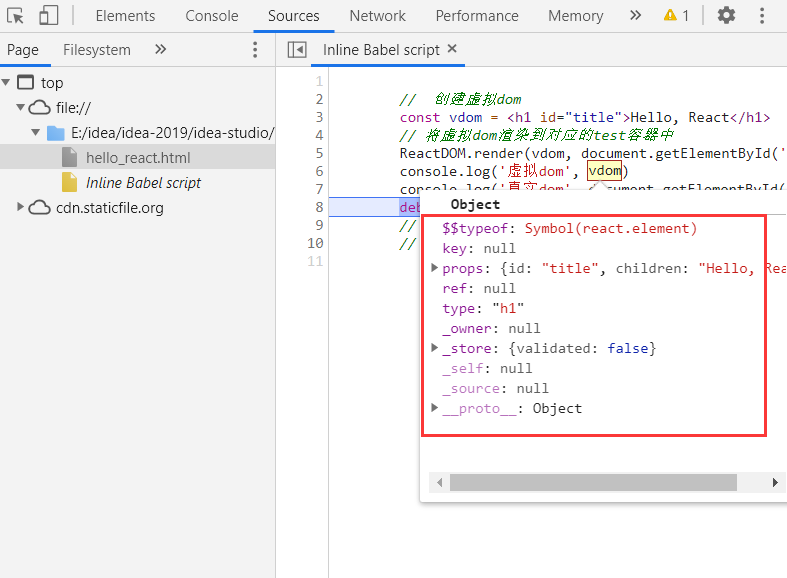
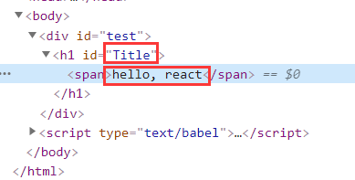
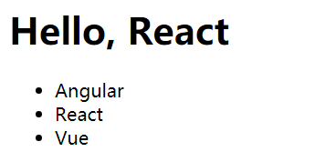
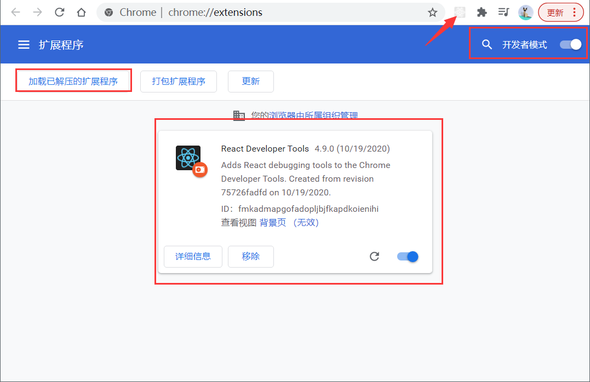
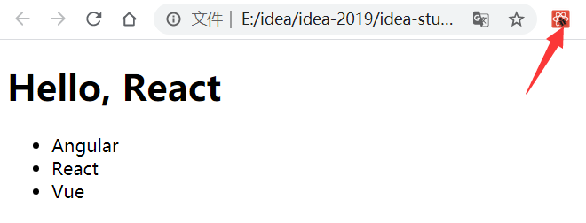
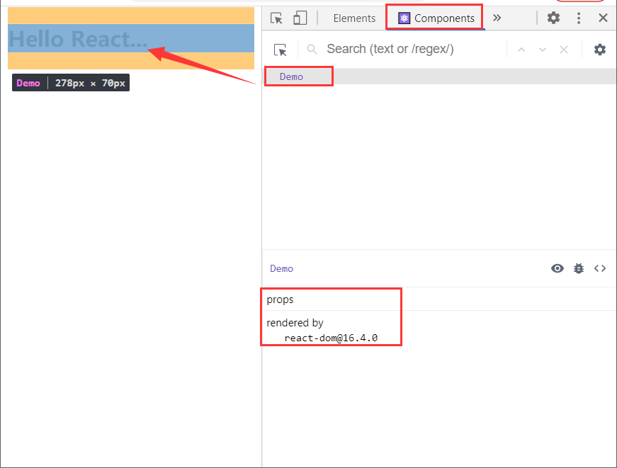
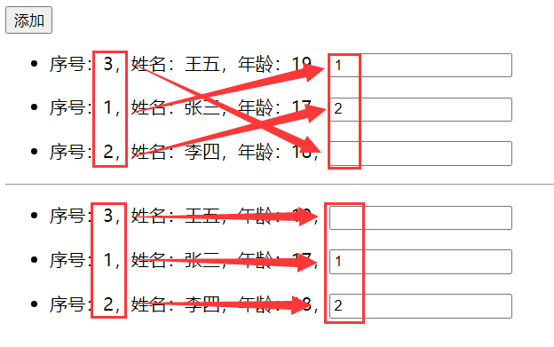
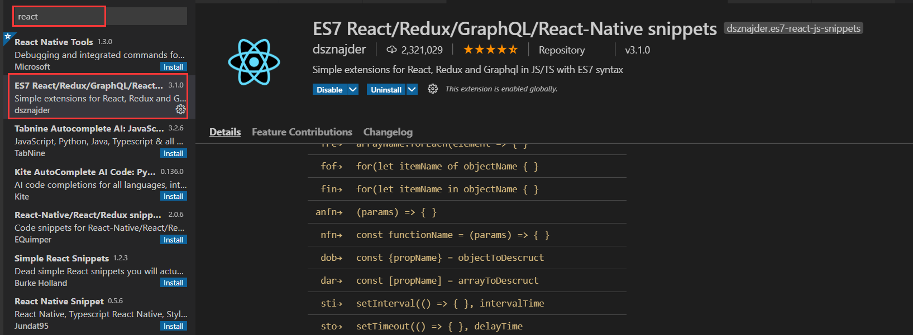
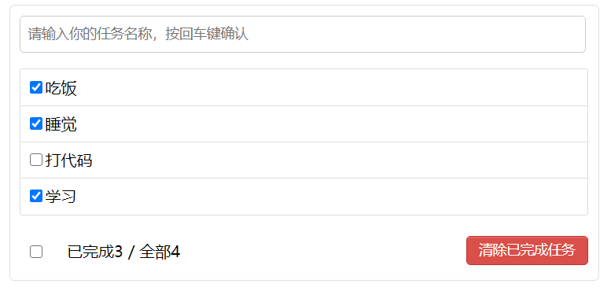

# 一、React的特点

1. 采用组件化模式、声明试编码，提高开发效率以及组件复用效率。
2. 在React Native中可以使用React语法进行移动端开发。
3. 使用虚拟DOM + 优秀的Diffing算法，尽量减少与真实DOM的交互。

## 1.虚拟DOM：

先将数据加载到虚拟DOM中，然后再渲染到真实的DOM中，其中虚拟DOM会与真实DOM进行比较，虚拟DOM会渲染到与真实DOM不同的组件，相同的地方不会重复渲染。


## 2.React包介绍

- react.developement：react的核心库。
- react-dom.developement：react的扩展库，提供与DOM相关的功能。
- babel.min：babel可以将ES6的代码转为ES5的代码，将jsx转为js。
  - jsx：是在js的基础上提出了一些新的要求和语法。jsx可以简化开发人员创建虚拟dom的代码。

## 3.Hello, React例子

下面是一个简单的react例子。

```react
<!DOCTYPE html>
<html lang="en">
<head>
    <meta charset="UTF-8">
    <title>react</title>
    <script src="https://cdn.staticfile.org/react/16.4.0/umd/react.development.js"></script>
    <script src="https://cdn.staticfile.org/react-dom/16.4.0/umd/react-dom.development.js"></script>
    <script src="https://cdn.staticfile.org/babel-standalone/6.26.0/babel.min.js"></script>
</head>
<body>
    <div id="test"></div>
    <script type="text/babel">
        //  创建虚拟dom，注意：不要加单引号（Jsx写法）
        const vdom = <h1>Hello, React</h1>
        // 将虚拟dom渲染到对应的test容器中
        ReactDOM.render(vdom, document.getElementById('test'));
    </script>
</body>
</html>
```

运行结果如下所示：


## 4.虚拟dom到底是个什么东西

（1）在以上的代码基础上添加以下两个输出。

```javascript
console.log('虚拟dom', vdom)
console.log('真实dom', document.getElementById('test'));
```

输出结果如下：


虚拟dom是带有属性的，而真实dom是直接输出。

（2）添加debugger进行调试如下：

```javascript
console.log('虚拟dom', vdom)
console.log('真实dom', document.getElementById('test'));
debugger
```

切换到浏览器刷新页面查看如下：


发现真实dom存在大量的属性，而虚拟dom只有几个属性如下：



### 关于虚拟dom总结

- 本质是Object类型对象。
- 虚拟dom比较“轻”，真实dom比较“重”，虚拟dom是在react中使用，存在内存中，无需真实dom那样这么多属性。
- 虚拟dom最终会被react转换为真实dom，并渲染在页面上。

# 二、认识Jsx语法

## 1.将变量渲染到页面上

虚拟dom中的元素可能存在变量，可以通过大括号来进行赋值如下：

```react
// 定义变量
const myId = 'Title'
const text = 'HELLO, REACT'
// 创建虚拟dom
const vdom = (
    <h1 id={myId}>
    <span>{text.toLowerCase()}</span>
</h1>
)
// 将虚拟dom渲染到对应的test容器中
ReactDOM.render(vdom, document.getElementById('test'));
```

toLowerCase是将字母转换为小写，结果如下：



## 2.定义标签样式

### 2.1设置class样式

通过className来设置虚拟dom中的css样式class。

```react
<script type="text/babel">
    // 创建虚拟dom
    const vdom = (
        // className为css中的样式class
        <h1 className="title">
        	<span>Hello, React</span>
        </h1>
    )
    // 将虚拟dom渲染到对应的test容器中
    ReactDOM.render(vdom, document.getElementById('test'));
</script>
<style>
    .title {
        background-color: red;
    }
</style>
```

结果如下所示：


### 2.2定义style样式

通过{{}}双大括号来定义style样式，其中fontSize要以驼峰名

```react
const vdom = (
    // 通过{{}}来定义style样式，其中fontSize要以驼峰名
    <h1 id="title">
        <span style={{color: 'white', fontSize: '20px'}}>Hello, React</span>
    </h1>
)
// 将虚拟dom渲染到对应的test容器中
ReactDOM.render(vdom, document.getElementById('test'));
```

{{}}：外面大括号包含的标识js语法，里面大括号包含的表示一个对象。

结果如下所示：


## 3.jsx总结

- 定义虚拟dom不要写引号。
- 标签中混入js表达式要用{}。
  - js表达式和js语句代码块时有区别的，一个表达式会产生一个值。
  - js表达式：
    - 变量：a
    - 算式：a + b
    - 方法调用：demo(1)
    - 数组遍历：arr.map()
    - 方法：function test() {}
  - js语句（代码块）：
    - 判断：if() {}
    - 遍历：for() {}
    - 判断：switch() {}
- 样式的类名指定不用class，用className。
- 内联样式，要用style={{key : value}}的形式。
- 只能有一个根标签，且标签必须闭合。
- 标签首字母：
  - 小写字母，则将该标签转为html中的同名元素进行对比，若不存在该标签则报错。
  - 若大写字母开头，react就去渲染对应的组件，若组件没有定义会报错。

## 4.循环渲染动态数据

通过data.map()来遍历虚拟dom。

```react
<body>
    <div id="test"></div>
    <script type="text/babel">
        const data = ['Angular', 'React', 'Vue']
        const vdom = (
            <div>
                <h1>Hello, React</h1>
                <ul>
                    {
                        data.map((item, i) => {
                            return <li key={i}>{item}</li>
                        })
                    }
                </ul>
            </div>
        )
        ReactDOM.render(vdom, document.getElementById('test'))
    </script>
</body>
```

效果如下：



注意：一般动态遍历组件时需要给组件添加key，做唯一标识，否则会报错。

## 5.安装react调试工具

> 添加谷歌浏览器的react调试工具，下载地址：[https://github.com/facebook/react-devtools/tree/v3](https://github.com/facebook/react-devtools/tree/v3)
>
> - 谷歌浏览器右上角打开"更多工具" -> "扩展程序"。
> - 打开右上角的"开发者模式"按钮，点击"加载已解压的扩展程序"，选择对应的解压包。如下：



- 若为红色，说明是本地调试。
- 若为正常颜色，说明是打包到线上运行。

如下为本地调试：



# 三、React基础

## 1.定义简单组件（函数组件）

通过函数定义组件并返回，通过React渲染到页面上，如下：

```react
<div id="test"></div>
<script type="text/babel">
    // 定义方法组件
    function Demo() {
    
        // 输出undefine，因为babel编译后开启了严格模式，将原本指向windows的this指向了undefine
        console.log(this)
        return <h2>Hello React...</h2>
    }
    // 将组件渲染到页面上
    ReactDOM.render(<Demo/>, document.getElementById('test'))
</script>
```

**注意：**

> - 调用组件函数时必须以标签的形式调用<Demo/>，标签必须要闭合。
> - 标签首字母要大写，否则react会以为是html默认标签，则报错。

通过调试工具的Components可以查看页面自定义组件，以及组件的属性



## 2.定义复杂组件（类组件）

通过定义类并继承到React.Component，这样才是一个类组件

```react
// 2.定义类组件
class Main extends React.Component {
    render() {
        return <h2>Hello React...</h2>
    }
}
// 将类组件渲染到页面上
ReactDOM.render(<Main/>, document.getElementById('test'))
```

- 在调用<Main/>标签过程中，会new出该实例对象来，并通过实例调用到原型上的render()方法。
- 将render中的虚拟dom解析成真实的dom，并返回渲染到页面上。

## 3.组件实例对象的三大核心属性：state（状态）、props（属性）、refs（引用）

### 3.1 属性1-state（状态）

> - state是组件对象最重要的属性，值是对象可以包含多个key-value。
>
> - 通过更新组件的state来更新对应的页面显示。

下面通过一个小案例来了解一下state的用法，通过点击字体来改变内容。

#### （1）click单击事件的三种方式

1. 通过类组件的构造器来设置state初始值。

2. 在render()方法中this.state获取其中的值。

3. 通过在组件设置onClick单击事件来调用方法。

```react
// 天气组件
class Weather extends React.Component {
    // 通过构造器赋值state
    constructor(props) {
        super(props)
        this.state = {isHot: true}
    }
    // 返回虚拟dom
    render() {
        // 获取state的isHot值
        const {isHot} = this.state
        // 通过onClick单击事件执行Click方法，注意：不要带括号()
        return <h2 id="title" onClick={Change}>今天天气很{isHot ? '热' : '冷'}</h2>
    }
}
// 将类组件渲染到页面上
ReactDOM.render(<Weather/>, document.getElementById('test'))

// 绑定单击事件，方法1
// const title = document.getElementById("title")
// title.addEventListener('click', () => {
//     console.log('我被点击啦...')
// })

// 绑定单击事件，方法2
// title.onclick = () => {
//     console.log('我被点击啦...')
// }

// 绑定单击事件，方法3（推荐写法，不用获取id节点）
function Change() {
    console.log('我被点击啦...')
}
```

#### （2）通过state实现页面状态改变

通过点击事件，改变页面上的值。

1. onClick中调用方法：
   - 若为类外面的方法，直接调用Change。
   - 若为类中的方法，this.Change调用。
2. 在构造器中通过bind(this)创建一个this在Change方法的原型中，这时Change方法中就可以获取到this，否则获取到的为undefine。
3. 在Change方法中改变状态值，注意：不能直接更改状态，需要通过`setState({key:value})`设置状态值

```react
// 天气类组件
class Weather extends React.Component {
    // 通过构造器赋值state
    constructor(props) {
        super(props)
        this.state = {isHot: false}
        // 通过bind获取原型链上的this指向，并创建一个this到该方法的原型上
        this.Change = this.Change.bind(this)
    }
    // 返回虚拟dom
    render() {
        const {isHot} = this.state
        // 通过onClick单击事件执行Click方法，注意：不要带括号()
        return <h2 onClick={this.Change}>今天天气很{isHot ? '热' : '冷'}</h2>
    }
    // 改变状态的方法
    Change() {
        const isHot = this.state.isHot
        // 需要通过父类内置的方法来设置state状态值
        this.setState({isHot: !isHot})
        console.log(this.state.isHot)

        // 错误写法，不能直接修改状态值
        // this.state.isHot = !isHot
    }
}
// 将类组件渲染到页面上
ReactDOM.render(<Weather/>, document.getElementById('test'))
```

总结：

1. constructor（构造器）：只调用1次，<Weather/>标签实例化调用。
2. render（渲染）：调用1 + n次，初次渲染时调用1次，后面修改状态还会继续调用。
3. Chane（自定义方法）：调用n次，每手动触发一次就调用一次。

#### （3）简化上面的代码

1. 通过类变量设置状态的初始值。
2. 通过箭头函数，在方法中获取this。

```react
class Weather extends React.Component {
    // 设置初始值
    state = {isHot: false}
    render() {
        const {isHot} = this.state
        return <h2 id="title" onClick={this.Change}>今天天气很{isHot ? '热' : '冷'}</h2>
    }
    // 通过箭头函数()=>可以直接获得类的this指向
    Change = () => {
        const isHot = this.state.isHot
        this.setState({isHot: !isHot})
    }
}
ReactDOM.render(<Weather/>, document.getElementById('test'))
```

因为react默认开启了严格模式（use strict），所以在类中的自定义方法不能获取到该类原型的this，需要通过箭头函数来获取。

### 3.2 属性2-props（属性）

#### （1）展开运算符...num：

通过展开运算符可以将数组元素进行展开。

```js
let arr1 = [1,3,5,7]
// 输出： (4)[1,3,5,7]
 console.log(arr1)
// 输出：1 3 5 7
console.log(...arr1)
// 通过展开运算符求和数组元素
function sum(...num) {
    // pre：上一次的返回值，当前的元素值
    return num.reduce((pre, cur) => {
        console.log(pre, cur)
        // 返回赋值给pre
        return pre + cur
    })
}
// 输出数组的和
console.log(sum(1,2,3,4,5))

// 对象的操作
let per1 = {name: 'zs', age: 18}
// 复制对象，同时修改属性值，添加属性值
let per2 = {...per1, name: 'ls', sex: '男'}
console.log(per2)
```

#### （2）props属性的使用

1. 通过类组件来定义props

```react
<!-- 注意：需要引入props依赖包 -->
<script src="https://cdn.bootcss.com/prop-types/15.6.1/prop-types.js"></script>

<script type="text/babel">
    class Student extends React.Component {

        // 对象属性类型限制
        static propTypes = {
            // name类型为String，且不能为空
            name: PropTypes.string.isRequired,
            // age类型为number数字
            age: PropTypes.number,
            // 限制speak为函数类型
            speak: PropTypes.func

        }

        // 设置标签属性的默认值
        static defaultProps = {
            age: 0
        }

        // 组件渲染
        render() {
            const{name, age} = this.props
            return (
                <ul>
                    <li>姓名：{name}</li>    
                    <li>年龄：{age}</li>    
                </ul>
            )
        }
    }

    const stu = {name: '李四', age: 20}
    // 通过...stu展开运算符将对象渲染到页面
    ReactDOM.render(<Student {...stu} speak={speak}/>, document.getElementById('test2'))

    function speak() {
        console.log('说话...')
    }
</script>
```

2. 函数组件使用props

```react
function Student(props) {
    const {name, age} = props
    return (
        <ul>
        	<li>姓名：{name}</li>    
			<li>年龄：{age}</li>    
		</ul>
	)
}

// 对象属性类型限制
Student.propTypes = {
    // name类型为String，且不能为空
    name: PropTypes.string.isRequired,
    // age类型为number数字
    age: PropTypes.number,

}

// 设置标签属性的默认值
Student.defaultProps = {
    name: 'zs',
    age: 0
}
const stu = {name: '李四', age: 20}
// 通过...stu展开运算符将对象渲染到页面
ReactDOM.render(<Student {...stu}/>, document.getElementById('test'))
```

类组件与函数组件主要的区别就是propTypes和defaultProps定义不一样：

- 类组件：在类中通过static定义方法。
- 函数组件：在同级函数中Student.propTypes的方式定义。

### 3.3 属性3-refs（引用） 

> 组件内标签可以定义ref属性来标识自己

通过按钮点击获取输入框的内容。

#### （1）字符串形式

```react
class Main extends React.Component {
    // 单击按钮事件触发
    showData = () => {
        // 通过ref获取input组件
        const {input} = this.refs
        // 输出input的值value
        console.log(input.value)
    }
    render() {
        return (
            <div>
                <input ref="input" type="text" placeholder="请输入"/><br/>
                <button onClick={this.showData}>提交</button>
            </div>
        )
    }
}
ReactDOM.render(<Main/>, document.getElementById("test"))
```

点击“提交”按钮，提示输入的内容如下：


#### （2）回调函数形式

```react
class Main extends React.Component {
    // 单击按钮事件触发
    showData = () => {
        // 该this是对应的refs，即标签自身
        const {input} = this
        // 输出input的值value
        alert(input.value)
    }
    render() {
        // 通过回调函数传入参数c，在将c赋值给this.input。c是标签自身
        return (
            <div>
                <input ref={c => this.input = c} type="text" placeholder="请输入"/>
                <br/>
                <button onClick={this.showData}>提交</button>
            </div>
        )
    }
}
ReactDOM.render(<Main/>, document.getElementById("test"))
```

注意：

- ref以回调的方式传入，在更新时会触发两次，即修改数据触发了render（状态驱动页面渲染）。
- 第一次会传入参数null，第二次才会传入DOM元素。
- 在渲染时需要清空旧的ref在创建一个新的函数实例。

通过查看官方文档：


下面例子会触发两次ref，通过改变状态中的isHot，会触发render，通过在回调中进行输出显示：

```react
class Main extends React.Component {
    state = {isHot: true}

    change = () => {
        const {isHot} = this.state
        this.setState({isHot: !isHot})
    }

    render() {
        const {isHot} = this.state
        // 回调中输出
        return (
            <div>
                <h1>{isHot ? '热' : '冷'}</h1>
                <button onClick={this.change} ref={c => console.log('我被更新了：', c)}>点击</button>
            </div>
        )
    }
}
ReactDOM.render(<Main/>, document.getElementById("test"))
```

当更新状态时，会连续触发两次ref的回调函数如下：


#### （3）类函数形式

通过将ref的回调函数定义成类中的函数，可以避免被触发两次的情况，如下：

```react
class Main extends React.Component {
    state = {isHot: true}

    change = () => {
        const {isHot} = this.state
        this.setState({isHot: !isHot})
    }

    // ref指向的函数
    click = (c) => {
        console.log('我被更新了：', c)
    }

    render() {
        const {isHot} = this.state
        // ref中指向类函数
        return (
            <div>
                <h1>{isHot ? '热' : '冷'}</h1>
                <button onClick={this.change} ref={this.click}>点击</button>
            </div>
        )
    }
}
ReactDOM.render(<Main/>, document.getElementById("test"))
```

#### （4）createRef容器存储ref指向的节点

createRef会创建一个容器并返回，该容器存储着ref指向的节点

```react
// 返回一个容器，该容器存储着ref指向的节点
ref1 = React.createRef()
// 单击按钮事件触发
showData = () => {
    // 输出input的值value
    console.log(this.ref1.current.value)
}

render() {
    return (
        <div>
            <input ref={this.ref1} type="text" placeholder="请输入"/>
            <br/>
            <button onClick={this.showData}>提交</button>
        </div>
    )
}
```

## 4.表单收集

### 4.1直接接收

当数据输入时，触发onChange然后将数据存储到state中，实现数据的双向绑定

```react
class Login extends React.Component {
    // 初始化数据
    state = {
        name: '',
        pwd: ''
    }

    // 提交表单
    handleSubmit = (event) => {
        event.preventDefault()
        // 通过ref获取input组件
        const {name, pwd} = this.state
        // 输出input的值value
        alert('账号：' + name + '，密码：' + pwd)

    }

    // 输入框数据改变就更新数据到state中
    saveName = (e) => {
        this.setState({name: e.target.value})
    }
    savePwd = (e) => {
        this.setState({pwd: e.target.value})
    }
    render() {
        return (
            <form action="http://baidu.com" onSubmit={this.handleSubmit}>
                账号：<input onChange={this.saveName} type="text" name="name" placeholder="请输入"/><br/>
                密码：<input onChange={this.savePwd} type="password" name="pwd" placeholder="请输入"/><br/>
                <button>登录</button>
            </form>
        )
    }
}
ReactDOM.render(<Login/>, document.getElementById("test"))
```

### 4.2通过函数柯里化处理

首先要了解什么是高阶函数？只要满足一下其中的一个条件就是高阶函数。

1. 参数是函数体。
2. 返回的值是函数体。

定义：通过函数调用并返回函数的形式，实现多次接收最后统一处理。

```react
class Login extends React.Component {
    // 初始化数据
    state = {
        name: '',
        pwd: ''
    }

// 提交表单
handleSubmit = (event) => {
    event.preventDefault()
    // 通过ref获取input组件
    const {name, pwd} = this.state
    // 输出input的值value
    console.log('账号：' + name + '，密码：' + pwd)

}

// 输入框数据改变就更新数据到state中
saveForm = (type) => {
    // 返回函数形式，e为回调的标签组件
    return (e) => {
        // 将接收到的值存储到state中，type为获取到的元素类型
        this.setState({[type]: e.target.value})
    }
}

render() {
    return (
        <form action="http://baidu.com" onSubmit={this.handleSubmit}>
            账号：<input onChange={this.saveForm('name')} type="text" name="name" placeholder="请输入"/><br/>
            密码：<input onChange={this.saveForm('pwd')} type="password" name="pwd" placeholder="请输入"/><br/>
            <button>登录</button>
        </form>
    )
}
}
ReactDOM.render(<Login/>, document.getElementById("test"))
```

## 5.React的生命周期

### 5.1引出生命周期

将要挂载 -> 挂载 -> 渲染 -> 将要卸载 -> 卸载

通过setInterval不断将透明度-0.1，当透明度为0时又变成1，如下：

```react
class Live extends React.Component {
    state = {opacity: 1}

    // 组件挂载完毕触发
    componentDidMount() {
        this.timer = setInterval(() => {
            let {opacity} = this.state
            // 每次将透明度-0.1
            opacity -= 0.1
            // 当小于0时设置为1
            if (opacity <= 0) opacity = 1
            // 相当于this.setState({opacity: opacity})
            this.setState({opacity})
        }, 500)
    }

    // 将要卸载组件触发
    componentWillUnmount() {
        clearInterval(this.timer)
    }

    // 卸载组件
    death = () => {
        ReactDOM.unmountComponentAtNode(document.getElementById('test'))
    }

    render() {
        return (
            <div>
                <h1 style={{opacity: this.state.opacity}}>今天天气真不错</h1>
                <button onClick={this.death}>不错</button>    
            </div>
        )
    }
}
ReactDOM.render(<Live/>, document.getElementById('test'))
```


当点击按钮的时候将组件卸载，就会全部消失。

### 5.2生命周期（旧）

.png)

####  （1）挂载时生命周期

如下例子演示了上图中React挂载时生命周期：

```react
class Count extends React.Component{
    // 构造器
    constructor(props) {
        console.log('Count===constructor')
        super(props)
    }

    // 将要挂载
    componentWillMount() {
        console.log('Count===componentWillMount')
    }

    // 挂载
    componentDidMount() {
        console.log('Count===componentDidMount')
    }

    // 渲染
    render() {
        console.log('Count===render')
        return (
            <div>
                <h1>今天天气真不错</h1>    
            </div>
        )
    }
} 
ReactDOM.render(<Count/>, document.getElementById('test'))
```

输出顺序如下所示：

构造器  -> 将要挂载  -> 渲染  -> 完成挂载


#### （2）更新时生命周期

##### 1. setState设置状态开始

```react
class Count extends React.Component{
    // 构造器
    constructor(props) {
        console.log('Count===constructor')
        super(props)
        this.state = {num: 0}
    }
    add = () => {
        const {num} = this.state
        this.setState({num: num + 1})
    }

    // 组件是否应该更新，若不定义该方法，默认返回true，若定义了需要自己返回
    shouldComponentUpdate() {
        console.log('Count===shouldComponentUpdate')
        // true：可以继续完成更新，false：终止在此，不继续执行
        return true
    }

    // 组件将要更新
    componentWillUpdate() {
        console.log('Count===componentWillUpdate')
    }

    // 组件更新
    componentDidUpdate() {
        console.log('Count===componentDidUpdate')
    }

    // 渲染
    render() {
        console.log('Count===render')
        return (
            <div>
                <h1>数字：{this.state.num}</h1>    
                <button onClick={this.add}>点击+1</button>
            </div>
        )
    }
} 
ReactDOM.render(<Count/>, document.getElementById('test'))
```

点击更新状态生命周期执行如下：

setState设置状态 -> 是否应该更新  -> 将要更新  -> 渲染  -> 完成更新


##### 2.forceUpdate强制更新开始

通过按钮点击调用forceUpdate强制更新。

```react
// 强制更新
force = () => {
    this.forceUpdate()
}
```

forceUpdate强制更新 -> 将要更新 -> 渲染 -> 完成更新


##### 3.父组件渲染

当父组件向子组件传参数时，会触发componentWillReceiveProps（将要接收到参数）

```react
// 父组件
class Parent extends React.Component {
    state = {age: 10}

    ageAdd = () => {
        this.setState({age: 15})
    }

    render() {
        return (
            <div>
                <h1>父亲</h1> 
                <Children age={this.state.age}/>
                <button onClick={this.ageAdd}>儿子年龄变化</button>   
            </div>
        )
    }
}

// 子组件
class Children extends React.Component {
    // 将要接收到参数
    componentWillReceiveProps() {
        console.log('Children===componentWillReceiveProps')
    }
    render() {
        return (
            <div>
                <h1>儿子，年龄：{this.props.age}</h1>    
            </div>
        )
    }
}
ReactDOM.render(<Parent/>, document.getElementById('test'))
```

注意：在第一次渲染时不会触发componentWillReceiveProps，在后面手动从父组件传参到子组件时会触发。

父组件向子组件传参数时，会经历以下生命周期：

父组件向子组件传参数 -> componentWillReceiveProps将要接收到参数 ->  是否应该更新  -> 将要更新  -> 渲染  -> 完成更新

**总结：**

> - 初始化阶段：初次渲染
>   - constructor()：构造器
>   - componentWillMount()：将要挂载
>   - render()：渲染
>   - componentDidMount()：完成挂载
>     - 常用：通常用来做初始化，发送请求
> - 更新阶段：由this.setState()或父组件render()触发
>   - shouldComponentUpdate()：是否应该更新
>   - componentWillUpdate()：将要更新
>   - render()：渲染
>   - componentDidUpdate()：完成更新
> - 卸载组件：由ReactDOM.unmountComponentAtNode()触发
>   - componentWillUnmount()将要卸载
>     - 常用：关闭界面做清空

### 5.3生命周期（新）

17.0.1版本之后，相对于之前的版本，React的生命周期做了一些调整。

将要弃用的三个方法：

- componentWillMount -> UNSAFE_componentWillMount
- componentWillUpdate -> UNSAFE_componentWillUpdate
- componentReceiveProps -> UNSAFE_componentReceiveProps

新版添加了两个方法s：

- getDerivedStateFromProps
- getSnapshotBeforeUpdate

.png)

#### （1）挂载时生命周期

getDerivedStateFromProps需要添加static标志位静态方法，同时传入props和state参数。

props：接收的props值，state：该类中的state值

```react
class Count extends React.Component {
    // 构造器
    constructor(props) {
        console.log('Count===constructor')
        super(props)
        this.state = {num: 0}
    }

    add = () => {
        const {num} = this.state
        this.setState({num: num + 1})
    }

    // props：接收的props值，state：该类中的state值
    static getDerivedStateFromProps(props, state) {
        console.log('Count===getDerivedStateFromProps：', props, state)
        // 需要返回null或状态state对象
        return state
    }

    // 挂载
    componentDidMount() {
        console.log('Count===componentDidMount')
    }

    // 组件是否应该更新，若不定义该方法，默认返回true，若定义了需要自己返回
    shouldComponentUpdate() {
        console.log('Count===shouldComponentUpdate')
        // true：可以继续完成更新，false：终止在此，不继续执行
        return true
    }

    // 组件更新
    componentDidUpdate() {
        console.log('Count===componentDidUpdate')
    }

    // 渲染
    render() {
        console.log('Count===render')
        return (
            <div>
                <h1>数字：{this.state.num}</h1>    
                <button onClick={this.add}>点击+1</button>
            </div>
        )
    }
}
// 页面加载时将num传到组件中
ReactDOM.render(<Count num={111}/>, document.getElementById('test'))
```

React挂载时生命周期如下：

构造器 -> getDerivedStateFromProps获取属性中衍生状态值 -> 渲染 -> 完成挂载


#### （2）更新时生命周期

```react
// 在更新之前获取快照，快照：值任意类型的值
getSnapshotBeforeUpdate() {
    console.log('Count===getSnapshotBeforeUpdate')
    // 该返回值会返回到componentDidUpdate方法中作为参数
    return '快照值'
}

// 组件更新
componentDidUpdate(preProps, preState, snapshotVal) {
    // preProps：更新前的属性值，preState：更新前的状态值，
    // snapshotVal：getSnapshotBeforeUpdate方法返回值
    console.log('Count===componentDidUpdate', preProps, preState, snapshotVal)
}
```

React更新时生命周期如下：

获取属性的衍生状态值 -> 是否应该更新 -> 渲染 -> 更新前获取快照 -> 完成更新


**总结：**

> - 初始化阶段：初次渲染
>   - constructor()：构造器
>   - **getDerivedStateFromProps()**：获取属性中衍生状态值
>   - render()：渲染
>   - componentDidMount()：完成挂载
>     - 常用：通常用来做初始化，发送请求
> - 更新阶段：由this.setState()或父组件render()触发
>   - **getDerivedStateFromProps()**：获取属性中衍生状态值
>   - shouldComponentUpdate()：是否应该更新
>   - render()：渲染
>   - **getSnapshotBeforeUpdate()**：更新前获取快照
>   - componentDidUpdate()：完成更新
> - 卸载组件：由ReactDOM.unmountComponentAtNode()触发
>   - componentWillUnmount()将要卸载
>     - 常用：关闭界面做清空

## 5.组件中key的作用

**常见面试题：**

为什么key不建议用index下标做标识？

> - React在将虚拟dom转换为真实dom时，需要通过dom中组件的key和组件内容来做比较。
> - 若虚拟dom和真实dom的key和组件内容一样，则不更新，否则将虚拟dom转换为真实dom。
> - 这个匹配机制就称为Diffing算法。
> - 例如：
>   - 向数组头部插入元素时，index下标就会全部发生变化。
>   - [a, b]下标[0, 1]，头部插入新元素A后[A, a, b]下标[0, 1, 2]。
>   - 发现原来的元素下标都发生了变化，当匹配发现key不一致时，所有的虚拟dom都转成了真实dom。
>   - 数据量少时没什么，当数据量上万条时，存在严重的效率问题，即需要重新生成上万条真实dom。

通过点击“添加”按钮，会在头部插入一条数据，如下：

```react
class Student extends React.Component {
    // 初始化学生数组
    state = {
        students: [
            {id: 1, name: '张三', age: 17},
            {id: 2, name: '李四', age: 18}
        ]
    }

    add = () => {
        const {students} = this.state
        const stu = {id: 3, name: '王五', age: 19}
        // 将新创建的学生信息添加到原来数组的头部
        this.setState({students: [stu, ...students]})
    }

    render() {
        return (
            <div>
                <button onClick={this.add}>添加</button>
                {
                    this.state.students.map((s, index) => {
                        return (
                            <ul key={index}>
                                <li>序号：{s.id}，姓名：{s.name}，年龄：{s.age}，</li>
                            </ul>
                        )
                    })
                }
                <hr/>
                {
                    this.state.students.map((s, index) => {
                        return (
                            <ul key={stu.id}>
                                <li>序号：{s.id}，姓名：{s.name}，年龄：{s.age}，</li>
                            </ul>
                        )
                    })
                }
            </div>
        )
    }
}
ReactDOM.render(<Student/>, document.getElementById('test'))
```

这里一般采用主键来标识key，这样避免了key重排序问题，也不会影响渲染效率。

**重排序带来的危害：**

在每条遍历的语句中添加上input输入框如下：

```react
<li>序号：{stu.id}，姓名：{stu.name}，年龄：{stu.age}，<input type="text"/></li>
```

分别输入序号到input中如下：


点击“添加”按钮后，上面是index作为key的input的内容与数据错乱，下面是id作为key却没有影响。

> ​		当在头部添加一条数据时，index会重新从0开始排序，即给原来的所有数据进行重排，Diffing算法在匹配过程中，key所在的标签及包含的子标签都会做对比，若子标签一样则不会重新渲染，而是渲染key所在标签的内容数据。



**总结：index做为key会引发的问题？**

- 若对数据进行逆序添加、逆序删除，或者其他更新操作会导致index发生重排序问题。
- 若结构中包含输入类的DOM（input、checkbox、radio...），会产生错误的DOM渲染。
- 若只是做一些数据展示，可以考虑用index，否则需要唯一标识的属性（id、电话号码、身份证...）做为key。

# 三、基于React脚手架

## 1.react脚手架

- 快速创建一个基于react库的模板项目。
  - 包含了所有需要的配置（语法检查、jsx编译、devServer...）。
  - 下载好了所有相关依赖，可以显示一个简单效果。
- create-react-app创建脚手架。
- 技术架构为：react、webpack、es6、eslint。
- 脚手架开发项目可以组件化、模块化、工程化。
  - 工程化：能够完成语法检查、代码压缩、语法转换、兼容性处理等一系列自动的处理称为工程化。

## 2.创建项目并启动

```shell
# 1. 全局安装，i是install的简写
npm i create-react-app -g

# 2. 切换到要创建的目录
create-react-app hello-react

# 3. 进入项目文件
cd hello-react

# 4. 启动项目
npm start
```

注意：若在执行create-react-app hello-react命令比较慢时，可以采用以下方法：

```shell
# 将npm设置为淘宝镜像
npm config set registry https://registry.npm.taobao.org

# 测试是否成功
npm config get registry

# 输出如下，表示设置成功
https://registry.npm.taobao.org/

# 然后再输入以下命令看看会不会有惊喜
create-react-app hello-react
```

启动成功后如下图所示：


### 2.1项目相关文件解释

--public：静态资源文件

​	--favicon.icon：网页图标

​	**--index.html：主页面**

​	--logo192.png：logo图片

​	--logo512.png：logo图片

​	--manifest.json：应用加壳配置文件

​	--robots.txt：爬虫协议文件，允许爬虫的内容

--src：源文件夹

​	--App.css：App组件的样式

​	**--App.js：App组件**

​	--App.test.js：用于给App做测试

​	--index.css：样式

​	**--index.js：入口文件**

​	--logo.svg：logo图

​	--reportWebVitals.js：检测记录页面的性能(需要web-vitals库的支持)

​	--setupTests.js：做应用的组件测试(需要jest-dom库的支持)

### 2.2index.html的文件内容解释

```react
<!DOCTYPE html>
<html lang="en">
  <head>
    <meta charset="utf-8" />
    <!-- %PUBLIC_URL%表示public路径 -->
    <link rel="icon" href="%PUBLIC_URL%/favicon.ico" />
    <!-- 开启立项视图，用于做移动端网页适配 -->
    <meta name="viewport" content="width=device-width, initial-scale=1" />
    <!-- 用于配置浏览器页签 + 地址栏的颜色（仅支持安卓手机的浏览器） -->
    <meta name="theme-color" content="#000000" />
    <!-- 网页描述 -->
    <meta
      name="description"
      content="Web site created using create-react-app"
    />
    <!-- 用于指定网页添加到手机主屏幕页签的图标 -->
    <link rel="apple-touch-icon" href="%PUBLIC_URL%/logo192.png" />
    <!-- 应用加壳时的配置文件，即转为app移动端时需要配置相关的信息都在该文件中 -->
    <link rel="manifest" href="%PUBLIC_URL%/manifest.json" />
    <title>React App</title>
  </head>
  <body>
    <!-- 若浏览器不支持js则显示对应内容出来 -->
    <noscript>You need to enable JavaScript to run this app.</noscript>
    <div id="root"></div>
  </body>
</html>
```

### 2.3手动创建文件

将创建的项目中的public和src两个文件移动到当前目录下的01_react_basic文件夹中。并创建需要的核心文件如下：

|--01_react_basic：基础脚手架

​	|--public：基础public文件

​	|--src：基础src文件

|--public：自定义文件夹

​	|--index.html：主页面

|--src：自定义文件夹

​	|--components：自定义组件

​		|--Hello：组件文件夹

​			|--Hello.css：组件css

​			|--Hello.jsx：组件jsx文件

​	|--App.js：App组件

​	|--index.js：入口文件

index.html：

```react
<!DOCTYPE html>
<html lang="en">
<head>
    <meta charset="UTF-8">
    <meta name="viewport" content="width=device-width, initial-scale=1.0">
    <title>react脚手架</title>
</head>
<body>
    <div id="root"></div>
</body>
</html>
```

App.js：

```react
// 创建组件App，引入React和Component，其中Component为独立暴露的形式，需要分别引入
import React, {Component} from 'react'
import Hello from './components/Hello/Hello'

// 创建并暴露该组件
export default class App extends Component {
    render() {
        return (
            <div>
                <Hello/>
            </div>
        )
    }
}
```

index.js：

```react
// 引入核心库
import React from 'react'
// 引入ReactDOM
import ReactDOM from 'react-dom'
// 引入组件
import App from './App'

// 渲染App到页面
ReactDOM.render(<App/>, document.getElementById('root'))
```

Hello.jsx

```react
import React, {Component} from 'react'
import './Hello.css'

export default class Hello extends Component {
    render() {
        return <h1 className="title">Hello, 你好...</h1>
    }
}
```

Hello.css

```react
.title {
    background-color: aqua;
}
```

效果显示如下：


### 2.4安装插件可以快速创建组件



安装完后在插件中可以看到很多的快捷键，其中：

创建类组件：rcc

创建方法组件：rfc

### 2.4实现Todos信息展示小案例



# 四、网络请求

网络请求一般包括异步和同步，通常情况采用异步请求。

## 1.axios发送异步请求

1.jQuery: 比较重, 如果需要另外引入，不建议使用。

2.axios: 轻量级, 建议使用。

- 封装XmlHttpRequest对象的ajax。

- promise风格。

- 可以用在浏览器端和node服务器端。

在使用axios前需要进行插件安装，如下：

```shell
# axios安装
npm i axios
```

## 2.跨域问题

一般在前后端分离中，由于端口号不同，需要进行解决跨域问题，通常有两种方法进行解决。

### 2.3方法一

在根目录下的package.json文件尾部添加，通过原端口代理到5000端口，如下：

```json
"proxy": "http://localhost:5000"
```

修改完请求地址后需要重启客户端

```react
// 服务器原来的地址端口为5000，配置了代理为3000的端口
axios.get('http://localhost:3000/students').then(
    res => {
        console.log('成功', res);
    },
    err => {
        console.log('失败', err);
    }
)
```

#### 注意：

​		并不是所有请求3000端口的地址都是服务器的地址，因为请求过程中先请求本地是否存在，若不存在才会向服务器发起请求。

请求以下路径就会请求本地资源：

```shell
http://localhost:3000/index.html
```


### 2.4方法二

在src目录下创建配置文件：src/setupProxy.js

该配置文件的内容如下：

```js
// 引入代理中间件
const proxy = require('http-proxy-middleware')

// 暴露该模块
module.exports = function(app) {
    app.use(
        // 代理到api1的请求地址：http://localhost:5000/api1
        proxy('/api1', {
            // 服务端请求地址
            target: 'http://localhost:5000',
            // 控制服务器收到请求头Host的值，true：服务器接收到端口5000，否则为3000
            changeOrigin: true,
            // 将api1转换为空，成为最终的请求地址
            pathRewrite: {'^/api1': ''}
        }),
        // 代理到api2的请求地址
        proxy('/api2', {
            target: 'http://localhost:5001',
            changeOrigin: true,
            pathRewrite: {'^/api2': ''}
        }),
    )
}
```

通过如下路径分别请求不同服务器地址：

```js
// 地址1
http://localhost:3000/api1

// 地址2
http://localhost:3000/api2
```

注意：端口为客户端开启的端口3000