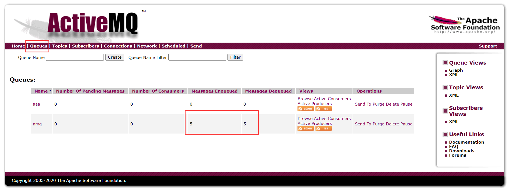

# 一、消息队列MQ（Message Queue）

>  参考书籍：《Spring Boot+Vue全栈开发实战》

消息队列（ Message Queue ）是种进程间或者线程间的异步通信方式，消息生产者在产生消息后，会将消息保存在消息队列中，直到消息消费者来取走它 ，即消息的发送者和接收者不需要同时与消息队列交互，使用消息队列可以有效实现服务的解耦，并提高系统的可靠性以及可扩展性。

## 1. JMS（Java Message Service）

JMS（Java Message Service）Java消息服务，字面上来看，是仅支持Java平台，消息服务，无非就是对外提供服务，也就是提供API。它通过统一JAVA API层面的标准，使得多个客户端可以通过JMS进行交互，大部分消息中间件提供商都对JMS提供支持，JMS和ActiveMQ的关系就像JDBC和JDBC驱动的关系。JMS包括两种消息模型：点对点和发布者/订阅者。

### 1.1ActiveMQ整合SpringBoot

由于 JMS 是一套标准，因此 Spring Boot 整合 JMS 必然就是整合 JMS 的某一个实现，本案例以ActiveMQ 为例来看 Spring Boot 如何进行整合。

#### 1.1.1 ActiveMQ简介

Apache ActiveMQ是个开源的消息中间件，它不仅完全支持 JMS1.1规范，而且支持多种编程语言，同时还提供了对spring框架的支持，以及集群的支持。

#### 1.1.2 ActiveMQ安装

ActiveMQ都是安装在Linux上的，因此，本案例的安装环境为CentOS 7, ActiveMQ版本为15.4.14 ，安装步骤如下（注意，要运行ActiveMQ，CentOS 上必须安装 Java 运行环境）

```shell
# 1.下载ActiveMQ
wget http://mirrors.hust.edu.cn/apache//activemq/5.15.14/apache-activemq-5.15.14-bin.tar.gz

# 2.解压下载文件
tar -zxvf apache-activemq-5.15.14-bin.tar.gz

# 3.启动ActiveMQ
cd apache-a
ctivemq-5.15.14
cd bin/
./activemq start

# 查看ActiveMQ的状态
./activemq status
# 停止ActiveMQ
./activemq stop
```

启动成功后，在浏览器输入http://120.25.151.112:8161，8161ActiveMQ 默认端口号，这时候需要进行登录，默认账号密码都是admin，登录成功后如下：


点击"Manage ActiveMQ broker"链接进入管理员控制台，如下：


#### 1.1.3 整合SpringBoot

Spring Boot ActiveMQ 置提供了相关的“ Starter ”，因此整合非常容易。首先创建 Spring Boot 项目，添加 ActiveMQ 依赖，pom.xml代码如下：

```xml
<dependency>
    <groupId>org.springframework.boot</groupId>
    <artifactId>spring-boot-starter-activemq</artifactId>
</dependency>
```

配置文件application.yml如下：

```yml
spring:
  activemq:
    # 配置broker地址，默认端口为61616
    broker-url: tcp://120.25.151.112:61616
    packages:
      # 支持发送对象消息
      trust-all: true
    # ActiveMQ的账号和密码
    user: admin
    password: admin
```

自定义消息类，如下：

```java
public class Message implements Serializable {

    private String content;
    private Date date;
 	
    // 省略get set toString...
}
```

接下来在项目创建一个Jms组件，如下：

```java
@Component
public class JmsComponent {

    // spring提供的消息发送模板
    @Autowired
    JmsMessagingTemplate jmsMessagingTemplate;

    /**
     * 消息发送，目标为"target"的消费者将接收到该消息
     * @param msg
     */
    public void send(Message msg) {
        jmsMessagingTemplate.convertAndSend(new ActiveMQQueue("target"), msg);
    }

    /**
     * 消息消费者订阅的目标为"target"
     * @param msg
     */
    @JmsListener(destination = "target")
    public void receive(Message msg) {
        System.out.println("receive：" + msg);
    }
}
```

测试类中调用JmsComponent组件进行消息发送，如下：

```java
@SpringBootTest
class ActivemqApplicationTests {

    @Autowired
    JmsComponent jmsComponent;

    @Test
    void contextLoads() {
        // 实例化自定义消息类
        Message msg = new Message();
        msg.setContent("hello activemq...");
        msg.setDate(new Date());
        // 发送消息
        jmsComponent.send(msg);
    }

}
```

成功后输出如下：


在控制面板中可以看到发送的消息个数：



## 2. AMQP（Advanced Message Queue Protocol）

AMQP（Advanced Message Queue Protocol）高级消息队列协议。协议无非就是需要遵循一定的数据规范，是在线路层上建立的，也就是应用层协议的一个开放标准，定义了网络交互的数据格式，而不是API接口（例如JMS），这使得AMQP和JMS从本质上的区别。它天然就是跨平台的，就像SMTP、HTTP 等协议样，只要开发者按照规范的格式发送数据，任何平台都可以通过AMQP进行消息交互。像目前流行的 StormMQ、RabbitMQ 等都实现了 AMQP。

### 2.1RabbitMQ整合SpringBoot

和JMS一样，使用 AMQP 也是使用 AMQP 的某个实现。

#### 2.1.1RabbitMQ简介：

RabbitMQ是一个实现了 AMQP 的开源消息中间件，使用高性能的 Erlang 编写。 RabbitMQ具有可靠性、支持多种协议、高可用、支持消息集群以及多语言客户端等特点，在分布式系统中存储转发消息，具有不错的性能表现。

#### 2.1.2 RabbitMQ安装：

由于RabbitMQ使用Erlang编写，因此需要先安装Erlang环境CentOS中安装Erlang 21.0 的步骤如下：

##### (1) 安装Erlang

```shell
# 1.下载安装包
wget http://erlang.org/download/otp_src_21.0.tar.gz

# 2.解压文件
tar -zxvf otp_src_21.0.tar.gz
cd otp_src_21.0.tar.gz

# 3.编译
./otp_build autoconf

# 若出现报错：./otp_build: line 319: autoconf: command not found，需要安装autoconf
yum install -y autoconf


# 重新编译，再执行如下命令
./configure
make

# 4.安装
make install

# 5.检查
erl -version

# 6.出现如下，表示安装成功
Erlang (SMP,ASYNC_THREADS,HIPE) (BEAM) emulator version 10.0
```

由于 yum 仓库中默认的 Erlang 版本较低，因此首先需要将最新的 Erlang 包添加到 yum 源中，执行如下命令：

```shell
# 1.将最新的Erlang包添加到yum源中
vim /etc/yum.repos.d/rabbitmq-erlang.repo

# 2.添加内容
[rabbitmq-erlang]
name=rabbitmq-erlang
baseurl=https://dl.bintray.com/rabbitmq/rpm/erlang/21/el/7
gpgcheck=1
gpgkey=https://dl.bintray.com/rabbitmq/Keys/rabbitmq-release-signing-key.asc
repo_gpgcheck=0
enabled=1

# 3.添加成功后，清除原有缓存并创建新缓存
yum clean all
yum makecache
```

##### (2) 安装RabbitMQ

```shell
# 1.下载文件
wget https://dl.bintray.com/rabbitmq/all/rabbitmq-server/3.7.7/rabbitmq-server-3.7.7-1.el7.noarch.rpm

# 2.开始安装
yum install rabbitmq-server-3.7.7-1.el7.noarch.rpm

# 3.若提示缺少socat依赖，则安装socat依赖
yum install socat

#启动
service rabbitmq-server start

#查看状态
rabbitmqctl status

#开启web插件
rabbitmq-plugins enable rabbitmq_management

#重启
service rabbitmq-server restart

#添加一个用户名为admin，密码为admin的用户
rabbitmqctl add_user admin admin

#设置admin用户的角色为管理员
rabbitmqctl set_user_tags admin administrator

#配置admin用户可以远程登录
rabbitmgctl set_permissions -p / admin ".*"".*"".*"
```


#### 2.1.3 整合SpringBoot 

##### (1) Direct

##### (2) Fanout

##### (3) Topic

##### (4) Header

